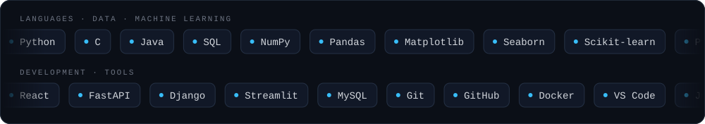
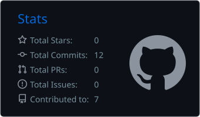
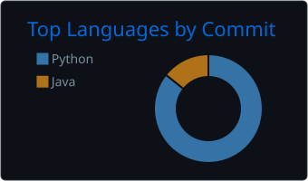

 

## About

I'm a B.Tech Information Technology student working across data science, machine learning and software development. I learn by building: some projects solve a specific problem, others are simply a way to understand a technology by using it.

At the moment I'm strengthening my fundamentals in data structures and algorithms, SQL, machine learning and backend development.

 

## Technical Skills

 

## Selected Projects

| Project | Description | Stack |
|:--|:--|:--|
| **RuralHealthGuide** | Lightweight, rule-based symptom guidance tool for rural and low-bandwidth users. Offers informational decision support, not diagnosis. | Python |
| **Movie Recommendation** | Content-based recommender built on the TMDB 5000 Movies dataset, with optional TMDB poster integration. | Python, FastAPI, React, Vite |
| **RentRadar-TN** | AI-powered real-estate valuation dashboard for the Tamil Nadu property market. | Python, Machine Learning |
| **Credit Card Fraud Detection** | Classification model that flags potentially fraudulent credit-card transactions. | Python, Pandas, NumPy, Scikit-learn |
| **Heart Disease Detection** | Predicts the likelihood of heart disease from patient input features. | Python, Pandas, Scikit-learn |
| **Crime Management System** | Application for managing crime-related records and information. | Java, MySQL |

 

## Current Focus

Practising DSA across arrays, strings, linked lists, stacks, queues, hashing, searching, sorting, trees, graphs, recursion, greedy and dynamic programming.

 

## GitHub

  
  

  <picture>
    <source media="(prefers-color-scheme: dark)" srcset="https://raw.githubusercontent.com/amrithsaravanan/amrithsaravanan/output/github-snake-dark.svg" />
    <source media="(prefers-color-scheme: light)" srcset="https://raw.githubusercontent.com/amrithsaravanan/amrithsaravanan/output/github-snake.svg" />
    
  </picture>

 

## Connect

  

